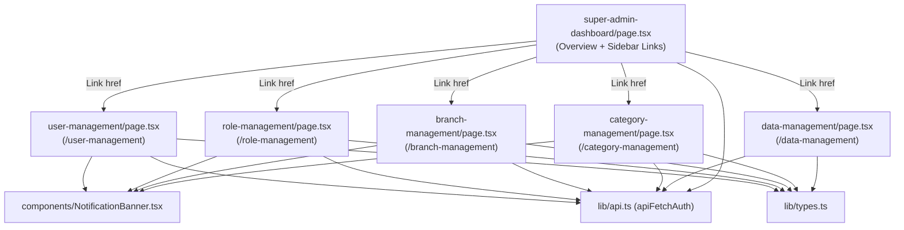

# Design Document: Super Admin Dashboard Refactor

## Overview

The Super Admin Dashboard currently lives in a single ~700-line file (`frontend/app/super-admin-dashboard/page.tsx`) that mixes UI, state, and API logic for four distinct functional areas. This refactor splits that file into self-contained standalone Next.js pages — one per module — each living at its own route. The shell at `/super-admin-dashboard` is slimmed down to the Overview section and a sidebar with `<Link>` navigation to each module route.

No backend changes are required. No user-facing behaviour changes. All CRUD operations remain identical.

---

## Architecture

The refactored dashboard follows a **standalone-route-per-module** pattern (Option B). Each functional area is a fully independent Next.js page that owns its own route, data fetching, state, and API calls. The shell (`super-admin-dashboard/page.tsx`) owns only the Overview metrics and sidebar navigation links.



### Key Design Decisions

**Standalone routes instead of in-page section switching.** Each module is a full Next.js page at its own URL. The sidebar uses `<Link>` components for navigation rather than `setActiveSection` state. This eliminates prop-drilling of shared reference data between modules.

**Each page fetches its own data on mount.** Since modules can no longer share props from a parent shell, each page runs its own `useEffect` to load the data it needs. For example, `user-management/page.tsx` fetches users, roles, branches, and categories independently.

**Shared types in `frontend/lib/types.ts`.** Because modules are no longer co-located under a single parent component, shared interfaces (`Role`, `User`, `Branch`, `Category`) are defined once in `lib/types.ts` and imported by each page.

**Branch and Category are split into separate routes.** The original `branch-category` section becomes two independent pages: `/branch-management` and `/category-management`. Each page fetches users for the in-use guard independently.

**Notification state stays local to each module.** Each page manages its own `notification` state and renders `NotificationBanner` directly. No global notification system needed.

**Each module page imports its own CSS from its local `globals.css`.** The empty `globals.css` files already exist in each module folder.

---

## Components and Interfaces

### Dashboard Shell (`frontend/app/super-admin-dashboard/page.tsx`)

Responsibilities:
- Renders sidebar with `<Link>` components to each module route
- Renders the Overview section (metrics cards) only
- Fetches overview stats on mount (`/stats/users`, `/stats/users-by-role`)
- No props passed to other pages — navigation is via Links

Sidebar links:
```
/user-management
/role-management
/branch-management
/category-management
/data-management
/payment-history
/employee-management
/salary-deductions
```

### UserManagement (`frontend/app/user-management/page.tsx`)

Owns: `users`, `roles`, `branches`, `categories`, `form`, `isEditing`, `isModalOpen`, `searchQuery`, `notification` state.
Owns: `loadUsers`, `loadSystemData`, `saveUser`, `editUser`, `deleteUser`, `handleStatusApproval`, `handleDirectStatusChange`, `resetUserPassword`, `handleChange`, `resetForm` handlers.
Fetches on mount: `/users`, `/roles`, `/branches`, `/categories`.

### RoleManagement (`frontend/app/role-management/page.tsx`)

Owns: `roles`, `roleId`, `roleName`, `roleStatus`, `notification` state.
Owns: `loadRoles`, `saveRole`, `editRole`, `resetRoleForm` handlers.
Fetches on mount: `/roles`.

### BranchManagement (`frontend/app/branch-management/page.tsx`)

Owns: `branches`, `users`, `branchForm`, `isEditingBranch`, `branchSearch`, `notification` state.
Owns: `loadBranches`, `saveBranch`, `editBranch`, `deleteBranch`, `handleBranchChange` handlers.
Fetches on mount: `/branches`, `/users` (for in-use guard).

### CategoryManagement (`frontend/app/category-management/page.tsx`)

Owns: `categories`, `users`, `categoryForm`, `isEditingCategory`, `categorySearch`, `notification` state.
Owns: `loadCategories`, `saveCategory`, `editCategory`, `deleteCategory`, `handleCategoryChange` handlers.
Fetches on mount: `/categories`, `/users` (for in-use guard).

### DataManagement (`frontend/app/data-management/page.tsx`)

Owns: `roles`, `users`, `dataTableRows` derivation, table rendering, `notification` state.
Fetches on mount: `/roles`, `/users`.

### NotificationBanner (`frontend/components/NotificationBanner.tsx`)

```typescript
interface NotificationBannerProps {
  type: 'success' | 'error';
  message: string;
  onClose: () => void;
}
```

Renders a dismissible banner with appropriate colours for success (green) and error (red), matching the existing inline notification markup exactly.

---

## Data Models

Shared types are defined in `frontend/lib/types.ts` and imported by each module page.

```typescript
// frontend/lib/types.ts

export interface Role {
  id: number;
  name: string;
  status: string;
}

export interface User {
  id: number;
  name: string;
  username: string;
  national_id: string;
  date_of_birth: string;
  email: string;
  phone_number: string;
  branch: string;
  payment_method: string;
  payment_number: string;
  password?: string;
  roleId: number;
  status: string;
  category: string;
  contract_type: string;
  contract_start?: string;
  contract_end?: string;
  education_level: string;
  status_request?: string | null;
}

export interface Branch {
  id: number;
  name: string;
  hubId: string;
  province?: string;
  district?: string;
  status: string;
}

export interface Category {
  id: number;
  name: string;
  code: string;
  status: string;
}
```

### File Structure

```
frontend/
  app/
    super-admin-dashboard/
      page.tsx          ← Shell: Overview metrics + sidebar Links
      globals.css       ← unchanged
    user-management/
      page.tsx          ← Standalone route: /user-management
      globals.css       ← already exists (empty)
    role-management/
      page.tsx          ← Standalone route: /role-management
      globals.css       ← already exists (empty)
    branch-management/
      page.tsx          ← Standalone route: /branch-management
      globals.css       ← already exists (empty)
    category-management/
      page.tsx          ← Standalone route: /category-management
      globals.css       ← already exists (empty)
    data-management/
      page.tsx          ← Standalone route: /data-management
      globals.css       ← already exists (empty)
  components/
    NotificationBanner.tsx
  lib/
    api.ts              ← unchanged
    types.ts            ← new: shared type definitions
```

### Sidebar Navigation Pattern

The shell sidebar uses `<Link>` for all module navigation. Each module page includes its own sidebar (or a back-link) for navigation between modules:

```tsx
// super-admin-dashboard/page.tsx sidebar
<Link className="nav-item active" href="/super-admin-dashboard">Overview</Link>
<Link className="nav-item" href="/user-management">User Management</Link>
<Link className="nav-item" href="/role-management">Role Management</Link>
<Link className="nav-item" href="/branch-management">Branch Management</Link>
<Link className="nav-item" href="/category-management">Category Management</Link>
<Link className="nav-item" href="/data-management">Data Management</Link>
<Link className="nav-link" href="/payment-history">Payment History</Link>
<Link className="nav-link" href="/employee-management">Employee Management</Link>
<Link className="nav-link" href="/salary-deductions">Salary Deductions Setup</Link>
```

Each module page replicates the same sidebar so navigation between modules works without returning to the shell first.

---

## Correctness Properties

*A property is a characteristic or behavior that should hold true across all valid executions of a system — essentially, a formal statement about what the system should do. Properties serve as the bridge between human-readable specifications and machine-verifiable correctness guarantees.*

### Property 1: NotificationBanner renders for all valid type/message combinations

*For any* `type` in `{'success', 'error'}` and any non-empty `message` string, the `NotificationBanner` component SHALL render a visible element containing the message text, and the rendered element SHALL have distinct visual styling for success vs. error.

**Validates: Requirements 3.2**

### Property 2: User form validation rejects incomplete submissions

*For any* user form submission where at least one of the mandatory fields (Full Name, Email, National ID, Telephone) is empty or whitespace-only, the `saveUser` handler SHALL not call the API and SHALL display an error notification.

**Validates: Requirements 6.1**

### Property 3: In-use guard prevents deletion of assigned branches and categories

*For any* branch or category that appears in at least one user's `branch` or `category` field respectively, calling `deleteBranch` or `deleteCategory` SHALL not call the DELETE API endpoint and SHALL display an error notification.

**Validates: Requirements 6.3**

### Property 4: API failure resilience on initial load

*For any* combination of API calls that throw an error during the initial `useEffect` of any module page, the page SHALL still render without throwing an unhandled exception, and all affected state values SHALL remain at their initial (empty/zero) defaults.

**Validates: Requirements 6.6**

---

## Error Handling

All module-level API calls follow the existing try/catch pattern:
- On success: call `showNotification('success', ...)` and trigger a data reload via the local load function.
- On failure: call `showNotification('error', err.message || 'fallback message')`.
- The `NotificationBanner` auto-dismisses after 5 seconds (matching current behaviour via `setTimeout`).

Each module page's `useEffect` wraps fetches in try/catch. Individual failures leave the corresponding state at its initial value (empty array), keeping the page usable.

User-facing error messages for `saveUser` preserve the existing 401/network error parsing logic verbatim.

---

## Testing Strategy

### Dual Testing Approach

Both unit tests and property-based tests are required. Unit tests cover specific examples and integration points; property tests verify universal correctness across generated inputs.

### Unit Tests

- Render `NotificationBanner` with `type='success'` and `type='error'` — assert correct CSS classes/colours and message text are present.
- Render `DataManagement` with known `roles` and `users` arrays — assert the table contains the correct row count and values.
- Render the Dashboard Shell — assert sidebar contains `<Link>` components to `/user-management`, `/role-management`, `/branch-management`, `/category-management`, `/data-management`, `/payment-history`, `/employee-management`, `/salary-deductions`.
- Mock `apiFetchAuth` to throw on all calls; render any module page — assert no unhandled exception and page renders with empty state.

### Property-Based Tests

Use `fast-check` (already installed in `frontend/node_modules/fast-check`). Configure each test to run a minimum of 100 iterations.

**Property 1: NotificationBanner renders for all type/message combinations**
```
// Feature: superadmin-dashboard-refactor, Property 1: NotificationBanner renders for all valid type/message combinations
fc.assert(fc.property(
  fc.constantFrom('success', 'error'),
  fc.string({ minLength: 1 }),
  (type, message) => {
    render(<NotificationBanner type={type} message={message} onClose={() => {}} />);
    expect(screen.getByText(message)).toBeInTheDocument();
  }
), { numRuns: 100 });
```

**Property 2: User form validation rejects incomplete submissions**
```
// Feature: superadmin-dashboard-refactor, Property 2: user form validation rejects incomplete submissions
fc.assert(fc.property(
  fc.record({
    name: fc.oneof(fc.constant(''), fc.string().filter(s => !s.trim())),
    email: fc.emailAddress(),
    national_id: fc.string({ minLength: 1 }),
    phone_number: fc.string({ minLength: 1 }),
  }),
  (formWithMissingName) => {
    // render UserManagement, fill form with at least one empty mandatory field
    // submit — assert apiFetchAuth was NOT called
  }
), { numRuns: 100 });
```

**Property 3: In-use guard prevents deletion**
```
// Feature: superadmin-dashboard-refactor, Property 3: in-use guard prevents deletion of assigned branches and categories
fc.assert(fc.property(
  fc.array(fc.record({ id: fc.integer(), name: fc.string({ minLength: 1 }), hubId: fc.string(), status: fc.constant('ACTIVE') }), { minLength: 1 }),
  (branches) => {
    // create users that reference branches[0].name
    // render BranchManagement with those users
    // call deleteBranch(branches[0].id)
    // assert DELETE endpoint was NOT called
  }
), { numRuns: 100 });
```

**Property 4: API failure resilience**
```
// Feature: superadmin-dashboard-refactor, Property 4: API failure resilience on initial load
fc.assert(fc.property(
  fc.subarray(['users', 'roles', 'branches', 'categories']),
  (failingEndpoints) => {
    // mock apiFetchAuth to throw for each endpoint in failingEndpoints
    // render any module page — assert no thrown error, assert page renders
  }
), { numRuns: 100 });
```

Each property-based test MUST be implemented as a single test case referencing the design property number in a comment using the format: `// Feature: superadmin-dashboard-refactor, Property N: <property text>`.
